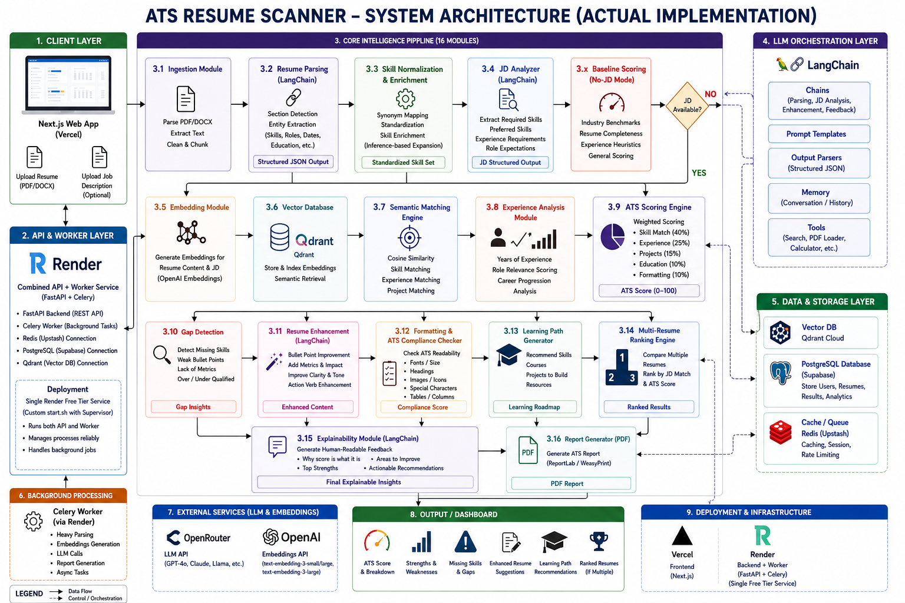

# 🚀 AI-Powered ATS Resume Scanner


An intelligent, production-grade ATS (Applicant Tracking System) optimizer that leverages Large Language Models and Vector Embeddings to provide deep analysis, scoring, and AI-driven enhancements for resumes against job descriptions.

**Live Demo:** [https://resume-ats-pi.vercel.app/](https://resume-ats-pi.vercel.app/)

---

## 📍 Table of Contents
- [Features](#-features)
- [Tech Stack](#-tech-stack)
- [Architecture Overview](#-architecture-overview)
- [Folder Structure](#-folder-structure)
- [Installation](#-installation)
- [Environment Variables](#-environment-variables)
- [API Routes](#-api-routes)
- [AI & RAG Pipeline](#-ai--rag-pipeline)
- [Database Setup](#-database-setup)
- [Deployment](#-deployment)
- [Troubleshooting](#-troubleshooting)

---

## ✨ Features
- **AI Resume Parsing:** Extracts structured data (skills, experience, projects) from PDF/Docx using LLMs.
- **Weighted Scoring Engine:** Calculates scores based on multi-factor algorithms (Skills 40%, Experience 25%, etc.).
- **JD Matching & Gap Analysis:** Identifies missing keywords and semantic gaps compared to specific Job Descriptions.
- **Semantic Search:** Uses Qdrant vector embeddings to find relevant experience beyond simple keyword matching.
- **AI Bullet Point Enhancement:** Rewrites resume descriptions using high-impact, professional action verbs.
- **Bulk Resume Ranking:** Compares and ranks multiple candidates against a single JD.
- **Async Processing:** Handles heavy AI tasks in the background using Celery and Redis.

---

## 🛠 Tech Stack

| Component | Technology |
| :--- | :--- |
| **Frontend** | Next.js 15+, React 19, Tailwind CSS 4, Recharts, Lucide |
| **Backend** | FastAPI (Python 3.11), Pydantic Settings |
| **AI Orchestration** | LangChain, OpenRouter (GPT-4o / GPT-4o-mini) |
| **Vector Database** | Qdrant (Semantic search & embeddings) |
| **Primary Database** | PostgreSQL (Supabase) |
| **Task Queue** | Celery & Redis (Upstash) |
| **Deployment** | Render (Backend), Vercel (Frontend) |

---

## 🏗 Architecture Overview


The system utilizes a distributed asynchronous architecture:
1. **Client:** Next.js frontend sends files to the FastAPI server.
2. **API:** Validates files and creates a "pending" job in PostgreSQL.
3. **Queue:** Task metadata is pushed to Redis.
4. **Worker:** Celery background worker consumes tasks, performs LLM parsing/scoring, generates embeddings, and updates the database.
5. **Retrieval:** Qdrant stores and retrieves vector representations for semantic similarity ranking.

---

## 📂 Folder Structure
```text
.
├── backend/                # FastAPI Application
│   ├── app/
│   │   ├── api/routes/     # API Endpoints (Resume, JD, Scoring, etc.)
│   │   ├── core/           # Business Logic (Ingestion, Scorer, Gap Detector)
│   │   ├── db/             # Client initializations (Postgres, Qdrant, Redis)
│   │   ├── models/         # Pydantic & DB Schemas
│   │   └── workers/        # Celery App & Background Tasks
│   ├── Dockerfile          # Production API/Worker Dockerfile
│   └── start.sh            # Combined process supervisor script
├── frontend/               # Next.js Application
│   ├── app/                # Pages & Layouts
│   ├── components/         # UI Components (Upload, Results, Charts)
│   └── lib/                # API client & Types
└── infra/                  # Infrastructure (Docker Compose, SQL init)
```

---

## 🚀 Installation

### 1. Prerequisites
- Python 3.11+
- Node.js 18+
- Docker & Docker Compose

### 2. Local Setup
```bash
# Clone the repository
git clone https://github.com/devkhurana02/resss_parser.git

# Start Infrastructure (Postgres, Redis, Qdrant)
docker-compose -f infra/docker-compose.yml up -d

# Setup Backend
cd backend
python -m venv venv
source venv/bin/activate
pip install -r requirements.txt
cp .env.example .env

# Setup Frontend
cd ../frontend
npm install
npm run dev
```

---

## 🔑 Environment Variables

### Backend (.env)
| Variable | Description |
| :--- | :--- |
| `DATABASE_URL` | PostgreSQL connection string (Port 5432 for direct, 6543 for pooler) |
| `REDIS_URL` | Upstash/Local Redis URL (`rediss://` for TLS) |
| `QDRANT_URL` | Endpoint for Qdrant Vector DB |
| `OPENROUTER_API_KEY` | API Key for LLM access |
| `APP_ENV` | `development` or `production` |

### Frontend (.env.local)
| Variable | Description |
| :--- | :--- |
| `NEXT_PUBLIC_API_URL` | URL of the running FastAPI backend |

---

## 📡 API Routes

| Endpoint | Method | Description |
| :--- | :--- | :--- |
| `/resume/upload` | `POST` | Upload PDF/Docx resume for processing |
| `/resume/{id}/status` | `GET` | Check processing status |
| `/jd/upload` | `POST` | Process Job Description text or file |
| `/analyze/` | `POST` | Trigger deep analysis between Resume and JD |
| `/rank/` | `POST` | Compare multiple resumes against one JD |
| `/health` | `GET` | System health check (API, DB, Redis) |

---

## 🤖 AI & RAG Pipeline
1. **Extraction:** `pdfplumber` extracts text -> LangChain `ParserChain` converts to JSON.
2. **Embedding:** Resume text is converted to 1536-dimensional vectors using `text-embedding-3-small`.
3. **Storage:** Vectors are stored in a Qdrant collection (`resume_embeddings`) with metadata.
4. **Scoring:** GPT-4o analyzes specific match criteria and provides qualitative feedback.

---

## 📦 Deployment

### Backend (Render)
- **Runtime:** Docker
- **Dockerfile Path:** `backend/Dockerfile`
- **Root Directory:** `backend`
- **Command:** `./start.sh` (Runs both API and Celery Worker in one container).

### Frontend (Vercel)
- **Framework:** Next.js
- **Root Directory:** `frontend`
- **Environment Variable:** Set `NEXT_PUBLIC_API_URL` to your Render endpoint.

---

## 🔧 Troubleshooting
- **Database Connection Timeout:** Ensure you are using port `5432` for local development if port `6543` (pooler) is blocked by your ISP.
- **Redis Timeout:** Use `rediss://` (with an `s`) for Upstash connections and ensure no trailing slashes in the URL.
- **Frontend 500 Error:** Ensure `FRONTEND_URL` is set in the backend environment variables to allow CORS.

---

## 📄 License
MIT License. Built by [devkhurana02](https://github.com/devkhurana02).
